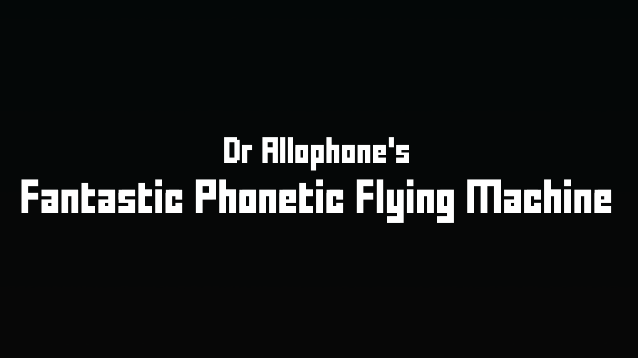
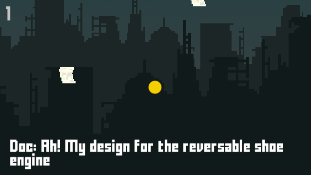

# Dr. Allophone's Fantastic Phonetic Flying Machine

A game created in 24 hours for the Great Steampunk Game Jam, York, 2016

Recover an inventor's bizarre inventions by taking to the sky in his new flying machine - powered by speech! His patented Phono-Motor to convert speech into motion. The more ridiculus the phrases you say, the more thrust it generates!

[Play it on itch.io](https://davidgundry.itch.io/doctor-allophones-fantastic-phonetic-flying-machine)

>Note: This was built for the Unity Web Player which is no longer supported. The APK for Android is out of date but still seems to work.

## Controls

The game is controlled by your Android device's accelerometer and microphone. Tilt your Android device left and right to move your flying machine. Talk to make it move upwards. The game uses a syllable detection algorithm.

## Research Context

This game was an experiment in providing context for eliciting speech with games. I created it during my PhD research into [designing games to collect human-subject data](https://etheses.whiterose.ac.uk/31655/).

## Gameplay Video 

https://user-images.githubusercontent.com/1508862/216830965-90d7a2a5-3cfe-4190-b7de-e63e7933ee18.mp4

## Screenshots

